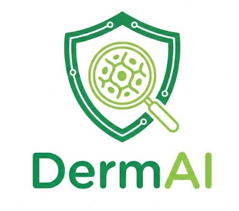
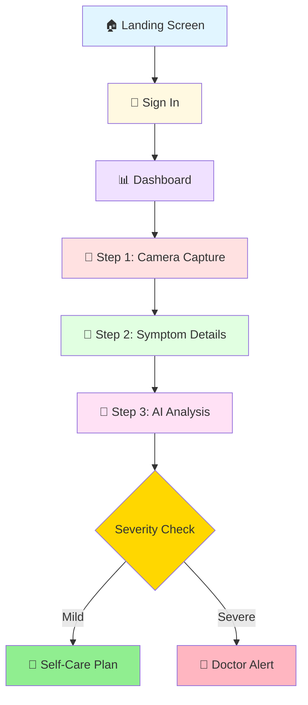

<div align="center">



# 🔬 Skin Diagnosis App

### AI-Powered Dermatology Assistant

[](https://reactnative.dev/)
[](https://expo.dev/)
[](https://developer.mozilla.org/en-US/docs/Web/JavaScript)
[](https://github.com)

*An intelligent mobile application that revolutionizes skin condition diagnosis through AI-powered analysis and personalized care recommendations.*

[Features](#-key-features) • [Installation](#-installation--setup) • [Architecture](#-app-flow-architecture) • [Tech Stack](#-dependencies)

</div>

---

## 📋 Overview

An **AI-powered mobile application** for skin condition diagnosis built with **React Native** and **Expo**. This comprehensive healthcare solution implements a complete user flow from authentication to AI-based diagnosis with intelligent conditional routing based on severity assessment.

---

## 🗺️ App Flow Architecture

### 📱 User Journey



---

## ✨ Key Features

### 1. 🚪 **Onboarding & Authentication**
- ✅ **Landing Screen**: Welcome page showcasing app features
- ✅ **Sign In Screen**: Secure user authentication system
- ✅ **Sign Up Screen**: New user registration

### 2. 📊 **Dashboard**
- 📜 Comprehensive scan history display
- ⚡ Quick action buttons for easy access
- 🎯 Start new diagnosis flow instantly
- 👤 Profile management
- 📖 Access to guides and help
- 🔔 Notifications center

### 3. 🔬 **Diagnosis Wizard (3-Step Process)**

#### 📸 Step 1: Camera Capture
- 📷 Real-time camera view with precision focus frame
- 🖼️ Gallery image picker as convenient alternative
- 🎨 Clean, intuitive UI design
- ⚠️ Error handling with helpful retry options

#### 📝 Step 2: Symptom Details
- 📊 Severity level slider (1-5 scale)
- 💢 Pain level slider (1-5 scale)
- ⏱️ Duration text input
- 📋 Additional symptoms description field

#### 🤖 Step 3: AI Analysis & Results
- ⏳ AI processing screen with engaging animations
- ⌛ Loading state with AI processing animation
- 🔥 **Heatmap Visualization Toggle** (Advanced FYP feature)
- 📈 AI confidence meter (0-100%)
- 🎯 Detected condition display
- 💡 Key insights and recommendations

### 4. 🎯 **Conditional Outcome Routing**

<table>
<tr>
<td width="50%">

#### 💚 Scenario A: Self-Care Plan
**For Mild Conditions**

- ✅ Step-by-step treatment plan
- ❌ Do's and Don'ts lists
- ⏰ Expected recovery timeline
- 📤 Share care plan option

</td>
<td width="50%">

#### 🏥 Scenario B: Doctor Alert
**For Severe Conditions**

- ⚠️ Warning banner with severity explanation
- 👨‍⚕️ Nearby dermatologists with ratings
- 📞 One-tap call functionality
- 🚨 Emergency information

</td>
</tr>
</table>

### 5. 📱 **Additional Features**

<table>
<tr>
<td width="50%">

#### 📚 Information & Support
- 📖 **Guide Screen**: Comprehensive user tutorials
- 💬 **Help & Support**: Get assistance
- ℹ️ **About**: App information
- 🔒 **Privacy Policy**: Data protection details

</td>
<td width="50%">

#### 👤 User Management
- 📊 **History**: View past diagnoses
- 👤 **Profile**: User information
- ✏️ **Edit Profile**: Update details
- 🔔 **Notifications**: Stay updated

</td>
</tr>
</table>

---

## 📁 Project Structure

```
📦 skin-diagnosis-app/
├── 📄 App.js                          # Main app with navigation setup
├── 📄 package.json                    # Dependencies & scripts
├── 📄 app.json                        # Expo configuration
├── 📄 babel.config.js                 # Babel configuration
├── 📂 assets/
│   ├── 🖼️ logo.png                   # App logo
│   ├── 🎨 icon.png                   # App icon
│   ├── 🌟 splash.png                 # Splash screen
│   ├── 🔲 adaptive-icon.png          # Android adaptive icon
│   └── 🌐 favicon.png                # Web favicon
├── 📂 context/
│   └── 🔄 DiagnosisContext.js        # Global state management
└── 📂 screens/
    ├── 🏠 LandingScreen.js           # Welcome/landing page
    ├── 🔐 SignInScreen.js            # User sign in
    ├── 📝 SignUpScreen.js            # User registration
    ├── 📊 DashboardScreen.js         # Main dashboard with quick actions
    ├── 📸 CameraScreen.js            # Camera capture (Step 1)
    ├── ⚠️ CaptureErrorScreen.js      # Error handling for camera
    ├── 📋 SymptomDetailsScreen.js    # Symptom input (Step 2)
    ├── ⏳ AIProcessingScreen.js      # AI processing animation
    ├── 🤖 AnalysisScreen.js          # AI results & analysis (Step 3)
    ├── 💚 SelfCarePlanScreen.js      # Mild condition care plan
    ├── 🏥 DoctorAlertScreen.js       # Severe condition alert
    ├── 📜 HistoryScreen.js           # Diagnosis history
    ├── 📖 GuideScreen.js             # User guide & tutorials
    ├── 👤 ProfileScreen.js           # User profile
    ├── ✏️ EditProfileScreen.js       # Edit profile information
    ├── 🔔 NotificationsScreen.js     # Notifications center
    ├── 🔒 PrivacyScreen.js           # Privacy policy
    ├── 💬 HelpSupportScreen.js       # Help & support
    └── ℹ️ AboutScreen.js             # About the app
```

---

## 🚀 Installation & Setup

### 📋 Prerequisites

Before you begin, ensure you have the following installed:

- ✅ **Node.js** (v16 or higher) - [Download](https://nodejs.org/)
- ✅ **npm** or **yarn** - Package manager
- ✅ **Expo CLI** - Install globally:
  ```bash
  npm install -g expo-cli
  ```

### 📥 Installation Steps

<details open>
<summary><b>Step 1: Install Dependencies</b></summary>

```bash
npm install
```

> 💡 **Tip:** If you encounter peer dependency issues, use `npm install --legacy-peer-deps`

</details>

<details open>
<summary><b>Step 2: Start Development Server</b></summary>

```bash
npm start
```

This will launch the Expo development server and display a QR code in your terminal.

</details>

<details open>
<summary><b>Step 3: Run on Device/Emulator</b></summary>

| Platform | Method |
|----------|--------|
| 📱 **iOS** | Press `i` or scan QR code with Expo Go app |
| 🤖 **Android** | Press `a` or scan QR code with Expo Go app |
| 🌐 **Web** | Press `w` |

</details>

---

## 🎓 Technical Highlights (for FYP Defense)

### 1. 🔥 **Heatmap Visualization**
> **Advanced Computer Vision Integration**

- 🎨 Toggle-based overlay showing AI attention areas
- 🧠 Demonstrates deep learning model interpretability
- 📍 **Location**: [AnalysisScreen.js](screens/AnalysisScreen.js)
- 🎯 **Purpose**: Visual explanation of AI decision-making process

### 2. 🧭 **Conditional Navigation Logic**
> **Intelligent Routing System**

Smart routing algorithm based on:
- 📊 **Severity level** (1-5 scale)
- 🎯 **AI confidence score** (0-100%)

**Decision Tree:**
```javascript
if (severity >= 4 || confidence <= 60%) {
  navigate('DoctorAlert');  // 🏥 Severe case
} else {
  navigate('SelfCarePlan');  // 💚 Mild case
}
```

📍 **Implementation**: [DiagnosisContext.js](context/DiagnosisContext.js)

### 3. 🔄 **Multi-Step Wizard Pattern**
> **State Management Excellence**

- 💾 State persistence across screens
- 🌐 Context API for global state management
- 🔗 Seamless data flow through diagnosis process
- ♻️ Reusable component architecture

### 4. 📸 **Camera Integration**
> **Native Device Feature Access**

- 📷 **expo-camera** for real-time capture
- 🖼️ Image picker fallback option
- 🔒 Permission handling system
- ⚡ Optimized image processing

---

## 📦 Dependencies

### 🎯 Core Technologies

| Package | Version | Purpose |
|---------|---------|---------|
|  | 19.1.0 | UI Framework |
|  | 0.81.5 | Mobile Framework |
|  | SDK 54 | Development Platform |

### 🧭 Navigation

- **@react-navigation/native**: ^6.1.9 - Navigation container
- **@react-navigation/stack**: ^6.3.20 - Stack navigator
- **react-native-gesture-handler**: ~2.28.0 - Touch gestures
- **react-native-screens**: ~4.16.0 - Screen optimization
- **react-native-safe-area-context**: ~5.6.0 - Safe area handling

### 🎨 UI Components

- **@react-native-community/slider**: 5.0.1 - Interactive sliders
- **expo-status-bar**: ~3.0.9 - Status bar styling

### 📱 Device Features

- **expo-camera**: ~17.0.10 - Camera integration
- **expo-image-picker**: ~17.0.10 - Gallery access

### 💾 Storage

- **@react-native-async-storage/async-storage**: 2.2.0 - Local data storage

---

##  Future Enhancements

<table>
<tr>
<td width="50%">

### 🤖 AI & Backend
- 🧠 Connect to real ML model
  - TensorFlow Lite
  - PyTorch Mobile
- 🔐 Implement authentication
  - Firebase Auth
  - Auth0
- 🗄️ Build diagnosis history database
  - MongoDB
  - PostgreSQL

</td>
<td width="50%">

### 📱 Features & UX
- 🎥 Telemedicine integration
  - Video consultation
  - Real-time chat
- 🌍 Multi-language support
  - i18n implementation
- 📴 Offline mode
  - Local storage
  - Background sync

</td>
</tr>
</table>

---

<div align="center">

## 📄 License

**Academic Project** - Final Year Project (FYP)  
© 2026 All Rights Reserved

---

## 👨‍💻 Contact & Support

<p>
  <a href="mailto:your.email@example.com">
    
  </a>
  <a href="#">
    
  </a>
</p>

**For questions or support related to this FYP project, contact us.**

---

### ⭐ Star this project if you found it helpful!

Made with ❤️ and Help of Usman,Rohail,Wajhat And Kumail Lashari.

</div>
